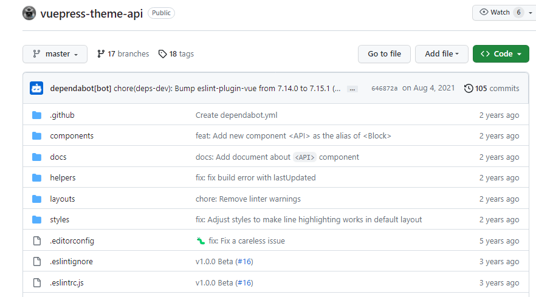
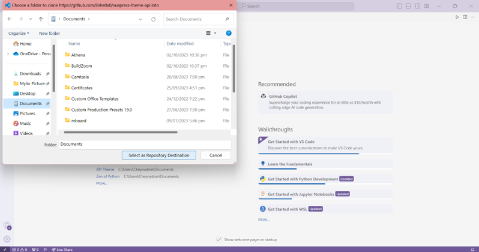
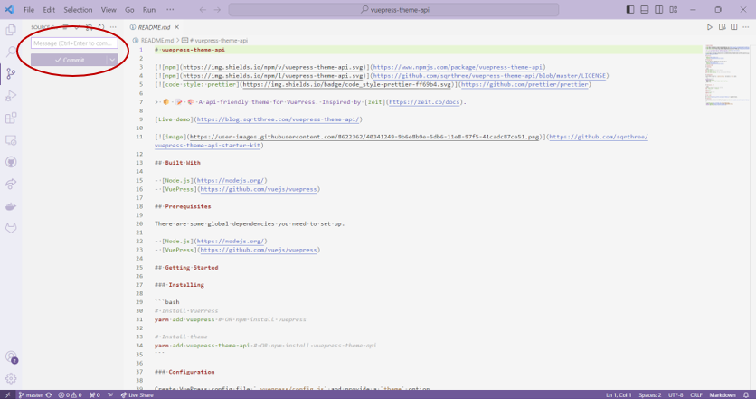

## What is GitHub?
GitHub is an online platform that lets developers collaborate efficiently by letting users view, access, and edit the codes of their projects.

## Git Terms
- **Clone** - A copy of the repository from your computer.
- **Repository** - The main folder that contains the project
- **Branch** - Serves as another version of the main project. This is to prevent making sudden changes to the main branch.
- **Pull** - Getting the updated code of the repository.
- **Push** - Updating the repository with the changes you made to the code.
- **Commit** - Saving your work without pushing it to the repository.
- **Merge** - Merging the changes from another branch to another branch.

## Steps

### Go to the link of the repository you want to clone
For this example, we're going to clone [`this repository`](https://github.com/linhe0x0/vuepress-theme-api) that contains one of Vuepress' themes named **API**.

### Copy the link of the repository
You can get the link from the address bar of the website or by clicking **"Code"** and copying the link from the HTTPS tab.

### Open Visual Studio Code
Click **"Clone Git Repository..."** and paste the link of your chosen repository.

### Choose the location
Choose the folder in which you want to save the repository that you are going to clone. For this example, we are going to save it in the **"Documents"** folder.

The repository is now successfully cloned in your computer. You can check this by clicking the **"Source Button"** at the upper left side to see if you are able to commit through the repository.

